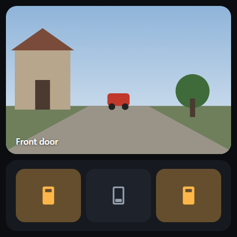
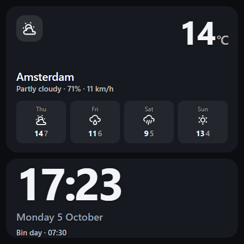

# NSPanel Cards

[](https://bunq.me/mennovanhout)

Lovelace cards built for one specific piece of hardware: the **Sonoff NSPanel Pro**, in both
sizes — the 3.95″ 480×480 square **Pro 86**, and the 4.7″ 750×1334 **Pro 120**.

Whichever one you have, it is a quad-core Cortex-A35 Rockchip (PX30 on the 86, RK3326S on the
120) with 2 GB of RAM and a Mali-G31, behind Android 8.1. That is 2018-class silicon. The
usual card packs are built for phones, and on this hardware their sliders lag, their hitboxes
are small and their text is tiny. Everything here is shaped by the constraint.

The two panels differ in shape, not in what they can afford to run, so the cards are the same
on both. What changes is how you lay them out — see
[Sizing for your panel](#sizing-for-your-panel).

<table>
<tr>
<td></td>
<td></td>
<td></td>
</tr>
<tr>
<td align="center"><sub>Lights</sub></td>
<td align="center"><sub>Climate</sub></td>
<td align="center"><sub>Status</sub></td>
</tr>
</table>

<sub>Rendered from `dist/nspanel-cards.js` at the panel's own 480×480, by
[`dev/bench.html`](dev/bench.html) — not mockups.</sub>

**New here?** The step-by-step, from an empty Home Assistant to a working panel and on to
the next one, is the [tutorial in the app repo](https://github.com/mennovanhout/nspanelpro-flutter/blob/main/TUTORIAL.md).
It starts with installing these cards.

## Cards

**Controls** — drag to set, tap to act, long-press for the full-screen surface:

| Card | What it does |
| --- | --- |
| `custom:nspanel-light-card` | Brightness. Drag anywhere, tap to toggle, long-press for the full-screen control. The fill takes the bulb's own colour. |
| `custom:nspanel-cover-card` | Blind/cover position. Same gestures; a tap while it is moving **stops** it. |
| `custom:nspanel-climate-card` | Target temperature. Drag to set it, long-press for HVAC modes. Tap opens more-info rather than toggling — turning the heating off by brushing past the panel is a bad afternoon. |
| `custom:nspanel-media-card` | Media player. Drag for volume, tap to play/pause, transport buttons on the face. |

**Actions** — fire and forget:

| Card | What it does |
| --- | --- |
| `custom:nspanel-button-card` | Scenes, scripts, automations. One big button, or up to six in a 1–4 column grid. Tells you the tap landed, and can ask twice before doing something drastic. |
| `custom:nspanel-camera-card` | A camera on the wall: a still at the card's own size, refreshed about once a second, and only while its page is on screen. Made for a doorbell page. |
| `custom:nspanel-swipe-card` | Pages side by side, swiped, with dots. The panel's own pager, so nothing else from HACS is needed; the native app reads it as its list of pages. |
| `custom:nspanel-switch-card` | Switches, input booleans, fans: the same grid, but each tile reflects its entity — lit while on — and a tap turns it the other way, echoed at once. |
| `custom:nspanel-alarm-card` | Arm and disarm an alarm. A button per mode, one Disarm when it is set, and a full-screen keypad when the alarm wants a code. |

**Information** — read-only, tap opens Home Assistant's own more-info dialog:

| Card | What it does |
| --- | --- |
| `custom:nspanel-sensor-card` | One reading, at 64px. Optional range bar and severity colours. |
| `custom:nspanel-sensors-card` | Two to four readings side by side, for a page that has to earn its space. |
| `custom:nspanel-status-card` | Doors, windows, locks, leaks. Quiet when all is well; with `only_problems` the usual state of the card is empty. |
| `custom:nspanel-weather-card` | Current conditions and a short forecast. |
| `custom:nspanel-clock-card` | Time, date, and an optional line from any entity. For the page a panel idles on. |
| `custom:nspanel-probe-card` | Diagnostics. Prints viewport, devicePixelRatio, WebView version and CSS feature support, read straight off the glass. |

## Gestures

| | |
| --- | --- |
| **Tap** | Toggle. On a moving cover, stop. |
| **Drag up / down** | Adjust, relative to the current value. The full card height is the full range. |
| **Long-press** (500 ms) | Full-screen control: an absolute slider, big ± steps, preset and action buttons. It stays live while open: a new track, play turning to pause, a change from elsewhere all show. |
| **Drag sideways** | Released back to the page, so a swipe card still changes page. |

A light, cover or media card with `fill_direction: horizontal` turns the drags around: it
fills from the left, adjusts on a sideways drag, and releases the vertical one instead. A swipe
that starts on that card adjusts it rather than changing page, so swipe from another card or
the gap between them.


Gestures apply to the control cards. The information cards are read-only: a tap opens HA's
more-info dialog, which is where history and settings already live.

## Why it isn't laggy

- **No service calls during a drag.** The card moves a block with `translate3d` and the CSS
  transition switched off, so the fill tracks your finger on the compositor. One call goes out
  when you let go. (`live: true` if you want throttled mid-drag updates.)
- **State can't yank the value back.** After a change the card ignores incoming state for
  `echo_ms` (1.5 s), so a slow round-trip can't make the slider jump backwards under your hand.
- **`hass` updates are diffed to one entity.** Home Assistant hands every card a fresh `hass`
  object whenever anything in the house changes; these cards compare the single state object
  they care about and return immediately otherwise.
- **Nothing expensive is animated.** Only `transform` and `opacity`. No `backdrop-filter`, no
  animated shadows, no continuous animation — the classic Mali-G31 killers.
- **The DOM is built once.** Updates touch custom properties and `textContent`, never `innerHTML`.
- **No framework, no dependencies.** Plain custom elements. The whole bundle is one file.

Browser baseline is **Chromium 108**, the minimum the HA Companion app needs on Android 8.1.
That rules out `color-mix()` and CSS nesting; neither is used.

## Install

### HACS (custom repository)

1. HACS → ⋮ → **Custom repositories**
2. URL: `https://github.com/mennovanhout/nspanel-cards`, category **Dashboard**
3. Install, then add the resource if HACS doesn't:
   `/hacsfiles/nspanel-cards/nspanel-cards.js`, type **JavaScript module**

### Manual

1. Copy `dist/nspanel-cards.js` to `/config/www/nspanel-cards.js`
2. Settings → Dashboards → ⋮ → Resources → `/local/nspanel-cards.js?v=0.18.2`, type
   **JavaScript module**

Home Assistant caches `/local/` hard. Bump the `?v=` when you update, or you will be looking at
the old file and wondering why nothing changed.

## Configuration

Every card has a **visual editor** — add one from the dashboard's card picker, or click the
pencil on an existing card, and you get HA's own controls: entity picker, icon picker,
switches, the lot. Every option in the tables below is in there.

The lists too: `presets`, `entities`, `buttons`, `switches` and `severity` are lists of
objects, and current Home Assistant draws those as a list with add, edit and delete and a
small form per item — an entity picker, a name, an icon. An older Home Assistant shows the
same field as a YAML box. Either way the editor never eats what you wrote by hand: it only
writes the fields it knows. (The probe card and the screensaver card have no editor.)

### Light

<table>
<tr>
<td valign="top">

```yaml
type: custom:nspanel-light-card
entity: light.dining_lights
title: Dining table
height: 260
presets:
  - name: Low
    brightness_pct: 15
  - name: Dinner
    brightness_pct: 45
    color_temp_kelvin: 2400
  - name: Full
    brightness_pct: 100
```

</td>
<td></td>
</tr>
</table>

That is the card at the top of the picture; below it is a second one with
`show_presets: false` and `height: 184`.

#### The card takes the light's colour

The fill is the bulb's own colour, not a fixed accent. The top card in the picture is a 2700K
warm white; the one below it is a colour lamp sitting on purple. Nothing to configure — Home
Assistant reports `rgb_color` for colour-temperature lights as well as colour ones, computed
from the kelvin, so a warm lamp tints the card warm on its own. A brightness-only or on/off
light reports no colour and keeps the amber default.

Bulb colours are not chosen to have text on them, though, and raw ones break the card at both
ends: a white or pale light washes the fill out until the label disappears into it, and a
saturated blue is so dark it vanishes against the card instead. So the colour is pulled into a
usable luminance band before it is used — scaled down when too bright, mixed toward white when
too dark. The hue survives, which is the part that matters: a blue lamp still reads blue.

Setting `accent` explicitly turns this off for that card — if you picked a colour, the card
does not argue — and `follow_color: false` turns it off while leaving the default amber.

| Option | Default | |
| --- | --- | --- |
| `accent` | amber `#ffb74a` | hex colour for the fill, the level line and the sheet; when set it wins over the bulb's colour |
| `follow_color` | `true` | use the bulb's colour for the fill, the level line and the sheet (only when `accent` is not set) |
| `fill_direction` | `vertical` | `horizontal` fills the card from the left, dims on a sideways drag and puts the name and state beside the icon, centred in height, with plates in the card's background colour under the icon + text and under the percentage, so they only show where the fill is; below `height: 160` there is no room for the presets and they are left out; the long-press sheet stays vertical |
| `fill_style` | `tint` | `tint` is the colour translucent over the dark card, so the text stays readable; `solid` is the colour exactly as given, fully opaque |

`fill_style: tint` lays the colour over the card at 62–34 % opacity, which shifts it: a yellow
`accent` reads olive. Use `solid` when you want the colour you picked, and choose one the white
text still reads against.

A preset takes any of `brightness_pct`, `color_temp_kelvin`, `rgb_color`, `effect`, or `scene`
(to fire a scene instead). `brightness_pct: 0` turns the light off.

### Cover

<table>
<tr>
<td valign="top">

```yaml
type: custom:nspanel-cover-card
entity: cover.blinds_living_room
title: Living room blinds
height: 260
presets:
  - name: Open
    position: 100
  - name: Privacy
    position: 35
  - name: Shut
    position: 0
```

</td>
<td></td>
</tr>
</table>

The fill descends from the top, the way a blind actually does: at 62% open it
covers the top 38% of the card.

Falls back to `open_cover` / `close_cover` when the entity doesn't advertise `SET_POSITION`.

The preset buttons are optional: `show_presets: false` drops the row, and `presets:` replaces
the default Open / Half / Shut with your own (up to four, each a `name` and a `position`).

**Sideways.** `fill_direction: horizontal` lays the card out like a horizontal light: the blind
comes in from the left as one solid area, without slat lines, and **dragging right brings it
down**, dragging left raises it. The name sits beside the icon on a plate, and presets are
left out below `height: 160`. `fill_style: solid` paints the blind in the accent, fully opaque.

**Tilt.** In the long-press sheet a cover that can set its tilt gets two tracks side by side,
**Position** and **Tilt**, each with its own value and both filling down from the top; releasing the tilt track calls
`set_cover_tilt_position`. A cover that can open and close its tilt gets HA's tilt buttons in
place of the ± steps - tilt open and tilt close (`open_cover_tilt` / `close_cover_tilt`), with
curved arrows. A cover without tilt keeps the single track and the ± steps.

| Option | Default | |
| --- | --- | --- |
| `fill_direction` | `vertical` | `horizontal`: blind from the left, drag right to close, name beside the icon |
| `fill_style` | `tint` | `solid` is the accent exactly as given, fully opaque |

### Climate

<table>
<tr>
<td valign="top">

```yaml
type: custom:nspanel-climate-card
entity: climate.living_room
title: Living room
height: 300
presets:
  - name: Eco
    temperature: 17
  - name: Day
    temperature: 20.5
  - name: Warm
    temperature: 22
```

</td>
<td></td>
</tr>
</table>

The drag range is the thermostat's own `min_temp`/`max_temp` unless you narrow it with `min`
and `max` — worth doing, because 7–35 makes every drag a wild one. `step` defaults to `0.5`
here rather than the `5` the percentage cards use. The long-press sheet lists whichever
`hvac_modes` the entity advertises. A preset takes `temperature`, `hvac_mode`, `preset_mode`,
or any combination.

The strip under the card in that picture is a `nspanel-sensors-card`; the whole page is
in [the panel view example](#a-full-480480-panel-view) below.

### Media

<table>
<tr>
<td valign="top">

```yaml
type: custom:nspanel-media-card
entity: media_player.kitchen
title: Kitchen
height: 300
presets:
  - name: Radio 4
    source: BBC Radio 4
  - name: Jazz
    source: Jazz24
  - name: Quiet
    volume_pct: 15
```

</td>
<td></td>
</tr>
</table>

The card fill is **volume**, so the drag gesture that dims a light sets the volume here, and
the long-press sheet gives you an absolute slider with the same transport buttons. Tap is
play/pause unless you give it an action of its own (below); `more_info: true` makes it open
the dialog instead, and wins over both.

Presets on this card are **favourites**, not levels. Each one is an action stated the way a
[button](#buttons) states it, a `volume_pct`, or both. There are none by default — the
transport row is what most panels want, and showing both rows needs about 300px.

#### Actions: favourites and tap

A favourite takes the button card's keys. `entity` alone runs what its domain implies —
`script.turn_on`, `scene.turn_on`, `automation.trigger`, `button.press`, and
`homeassistant.toggle` for anything else — and `service:` with optional `data:` states the call
outright, with or without an entity. The entity goes in as `entity_id` unless `data` names one.
`volume_pct` still sets this player's volume, and with an action as well the volume goes
first:

```yaml
presets:
  - name: Morning radio
    entity: script.morning_radio
  - name: Jazz
    service: media_player.play_media
    data:
      entity_id: media_player.kitchen
      media_content_id: https://jazz24.example/stream.mp3
      media_content_type: music
  - name: Quiet
    volume_pct: 15
  - name: News, low
    entity: script.news
    volume_pct: 20
```

The older shorthands still work: `source` calls `select_source` on this player, and
`media_content_id` with optional `media_content_type` (default `music`) calls `play_media` on it.

A tap on the card takes the same three keys with a `tap_` in front. Nothing is filled in for
you: `tap_service` without `tap_entity` sends exactly `tap_data`, so name the player there if
the service wants one.

```yaml
tap_entity: script.kitchen_music_toggle
# or
tap_service: media_player.media_stop
tap_data:
  entity_id: media_player.kitchen
```

In the long-press sheet, a **tap** on the volume track mutes or unmutes the player; a drag sets
the volume as usual. A muted player still shows its volume, in grey, on the card and in the
sheet. A player without mute support keeps the plain slider, where a touch sets the volume.

Buttons grey themselves out when the player does not advertise the feature, and the whole card
degrades quietly: no `VOLUME_SET` and the fill still tracks your finger, it just does not send
anything.

Album art is the one thing in this bundle that decodes a bitmap. It is held to a fixed 76px
box, and the `src` is only assigned when the URL actually changes — reassigning the same `src`
makes the browser decode it again, and on a media card a render happens on every volume tick.
`show_art: false` drops it for the domain icon.

| Option | Default | |
| --- | --- | --- |
| `show_art` | `true` | album art, else the domain icon |
| `show_transport` | `true` | previous / play-pause / next |
| `more_info` | `false` | `true` makes tap open the dialog instead of play/pause or `tap_*` |
| `tap_entity` | — | tap runs this entity, as a button would (instead of play/pause) |
| `tap_service` | — | tap calls this service (`domain.service`) |
| `tap_data` | — | data for `tap_service` |
| `presets` | none | favourites, up to 4: `name`, `entity`, `service`, `data`, `volume_pct`; the shorthands `source`, `media_content_id`, `media_content_type` |
| `accent` | violet `#a78bfa` | hex colour for the fill, the level line and the sheet |
| `fill_direction` | `vertical` | `horizontal` fills the card from the left, sets the volume on a sideways drag and puts the title and artist beside the art, centred in height above the buttons, on plates in the card's background colour; button rows that do not fit the height are left out (transport needs `height: 160`, both rows 228) |
| `fill_style` | `tint` | as on the light card: `solid` is the colour exactly as given, fully opaque |
| `volume_zoom` | `0` (off) | below `volume_zoom_below` the card is a 0–`volume_zoom` slider instead of 0–100 |
| `volume_zoom_below` | `25` | the volume, in percent, under which `volume_zoom` applies |

#### A finer scale for quiet listening

Most listening happens in the bottom quarter of the range, where a 0–100 card leaves you a few
pixels per step. With `volume_zoom: 30`, a player under 25% is drawn on 0–30: the whole card is
30%, a small `0–30` under the number says so, and the percentage stays the real volume. At 25%
and up it is the usual 0–100.

The scale is fixed for as long as your finger is down and worked out again when you let go, so
it never jumps under the finger: drag to the end of 0–30 and you get 30%; the next drag is on
0–100. A change from elsewhere that crosses the threshold does move the fill, from nearly full
to a quarter or back. The long-press sheet is always 0–100.

```yaml
volume_zoom: 30
volume_zoom_below: 25
```

With `fill_direction: horizontal` the art shrinks to the 52px of the icon box, so it lines up
with a horizontal light card beside it.

### Buttons

<table>
<tr>
<td valign="top">

```yaml
type: custom:nspanel-button-card
height: 300
columns: 2
buttons:
  - entity: script.goodnight
    name: Goodnight
    icon: mdi:weather-night
    confirm: true
  - entity: script.good_morning
    name: Good morning
    icon: mdi:weather-sunset
  - entity: scene.movie
    name: Movie
    icon: mdi:sofa-outline
  - entity: script.leaving
    name: Leaving
    icon: mdi:lock
```

</td>
<td></td>
</tr>
</table>

For one button, skip the list:

```yaml
type: custom:nspanel-button-card
entity: script.goodnight
title: Goodnight
icon: mdi:weather-night
height: 144
```

`columns` puts 1 to 4 across, never more than there are buttons: the buttons in a row
always share its full width, so two buttons under `columns: 3` are two half-width buttons — the
lower card in the picture is `columns: 3`, its first button icon-only and lit by a boolean. Six buttons is the cap; more than that on a 480px
panel is a list of things you cannot read, let alone hit.

**Every other card here reflects a state. These do not.** You press "Goodnight", the house
does fifteen things over the next minute, and the entity you pressed looks exactly as it did
before — so the card has to supply the acknowledgement itself. It does: the press scales the
button, a haptic fires, and the button holds an accent tick for `feedback_ms` (1.2s). A script
that reports `on` while it runs keeps the accent for as long as it is running, which is the
green button in the picture.

The other half of that problem is misfires. "Goodnight" at four in the afternoon is a
genuinely annoying thing to do to a household, and a wall panel is exactly what people brush
past. `confirm: true` makes a button ask for a second tap within three seconds, and say so
while it waits.

The service is worked out from the entity's domain — `script.turn_on`, `scene.turn_on`,
`automation.trigger`, `button.press`, `input_button.press`, `vacuum.start`, and
`homeassistant.toggle` for anything else, which covers lights, switches and input booleans.
Override it per button with `service:` and optional `data:`, with or without an entity:

```yaml
buttons:
  - name: Ping my phone
    service: notify.mobile_app_pixel
    data:
      message: The panel says hello
```

A long-press on a button opens more-info for its entity, which is where you go to find out why
the scene did not do what you expected.

| Option | Default | |
| --- | --- | --- |
| `buttons` | — | up to 6; `entity` alone is the one-button shorthand |
| `columns` | `2` | 1–4, capped at the number of buttons; a row is always shared by the buttons in it. Four across suits icon-only rows (`show_name: false`) |
| `confirm` | `false` | ask for a second tap; also settable per button |
| `confirm_text` | `Tap again` | shown while it waits |
| `feedback_ms` | `1200` | how long the tick holds |
| `haptics` | `true` | |
| `more_info` | `true` | long-press opens the dialog |

**Lit by something else, in its own colour, or icon only.** A button is lit while its own
entity is `on` - a running script, a switch, a boolean. `state_entity` lights it from another
entity instead: a scene button that glows while the `input_boolean` your automation sets is
on. `color` gives that button its own lit colour, and `show_name: false` drops the name so
the icon takes the room, on the card or per button:

```yaml
type: custom:nspanel-button-card
height: 144
columns: 3
show_name: false
buttons:
  - entity: script.movie_mode
    icon: mdi:movie-open
    state_entity: input_boolean.movie_mode
    color: '#a78bfa'
  - entity: script.normal
    icon: mdi:skip-backward
  - entity: scene.bright
    icon: mdi:white-balance-sunny
    show_name: true
    name: Bright
```

| Option | Default | |
| --- | --- | --- |
| `show_name` | `true` | `false` shows the icon only; also settable per button |
| `icon_scale` | `1` | enlarges (or shrinks) the icons; also settable per button |
| `colors` | — | maps colour names from `color_attribute` to your own colours |

An icon-only button sizes its icon to the button, 60% of its shorter side, so a tall button
gets a big icon. Some custom icon sets draw their shape with a margin inside the icon's frame
and still come out small; `icon_scale: 1.4` (or whatever looks right) makes up for it.

**A custom SVG icon that will not grow** is almost always missing its `viewBox`. An
`<svg width="24" height="24">` without one cannot scale: asked for 60px it draws its 24px
inside a 60px frame, top left, and `icon_scale` cannot help. Start the file with
`<svg viewBox="0 0 24 24" ...>` instead. `icons/` holds the blinds icons this way - one path
each, the shape an MDI icon has - and `icons/custom-icons.js` holds the same paths for pages
that are not HA: load it beside `kiosk/icons.js` (the bench does), or put your own
`window.NS_CUSTOM_ICONS = { 'custom:name': 'M...' }` in `kiosk/config.js`.

**Coloured by an attribute.** `color_attribute` paints the whole button in the colour an
attribute names, read from the button's entity or from `color_entity`. Any CSS colour works -
a name like `Purple` in any case, or a hex code - and the icon and name turn dark on a light
colour. `Black`, `none` or an empty attribute leave the button as it normally looks. CSS's own
`purple` is a dark `#800080`, so `colors` maps names to your palette; a name it does not list
is used as it is. A painted button stays in its colour when it is lit or pressed: the attribute
is the state.

```yaml
type: custom:nspanel-button-card
height: 160
columns: 3
show_name: false
colors:
  Purple: '#a78bfa'
buttons:
  - entity: cover.pertemp
    icon: custom:persienn öppen
    icon_scale: 1.4
    service: cover.open_cover
    color_attribute: upstatus
  - entity: cover.pertemp
    icon: custom:persienn stängd
    icon_scale: 1.4
    service: cover.close_cover
    color_attribute: downstatus
```

Per button: `entity`, `name`, `icon`, `service`, `data`, `confirm`, `confirm_text`,
`state_entity`, `color`, `show_name`, `icon_scale`, `color_attribute`, `color_entity`.

### Swipe

```yaml
type: custom:nspanel-swipe-card
dots: true            # the page dots at the bottom; default true
start: 0              # the page to open on; default 0
card_spacing: 12      # px between pages; default 12
cards:
  - type: vertical-stack
    cards: [...]      # page 1
  - type: vertical-stack
    cards: [...]      # page 2
```

The panel's own pager: pages side by side, a finger moves between them, dots say where you
are. Each page is one card, usually a vertical-stack that adds up to the panel's height. It is
a native scroll-snap container, not a script - the cards release sideways drags to it and the
browser pans on the compositor, which is the smoothest thing this hardware does. The native app
reads the same card as its list of pages and honours `dots` and `start`.

If you already use [simple-swipe-card](https://github.com/nutteloost/simple-swipe-card),
nothing changes: the app treats any swipe card the same, and this card understands
`show_pagination: false` too. Switching is one word in the YAML.

| Option | Default | |
| --- | --- | --- |
| `cards` | — | the pages |
| `dots` | `true` | page dots; `show_pagination: false` means the same |
| `start` | `0` | first page shown |
| `card_spacing` | `12` | px between pages |

### Switches

<table>
<tr>
<td valign="top">

```yaml
type: custom:nspanel-switch-card
height: 300
columns: 2
switches:
  - entity: switch.garden_lights
    name: Garden
    icon: mdi:flower
  - entity: switch.fountain
    name: Fountain
  - entity: input_boolean.guest_mode
    name: Guest mode
    icon: mdi:account-group
  - entity: fan.bedroom
    name: Bedroom fan
```

</td>
<td></td>
</tr>
</table>

For one switch, skip the list: `entity: switch.garden_lights` with `title` and `icon`, as on
the button card.

The button card fires and forgets; this one reflects. Each tile is lit in the accent while its
entity is `on`, with the state written under the name, and a tap turns it the other way. The
tap is echoed at once: the tile shows the new state for `echo_ms` before Home Assistant
answers, so a slow round-trip never shows the old state under a finger. The card calls
`homeassistant.turn_on` or `turn_off` for what the tap wants rather than `toggle`, so two
quick taps cannot race each other into the wrong state.

It takes anything whose whole story is on or off: `switch`, `input_boolean`, `fan`,
`automation` (enabled or not), `humidifier`, `siren`, `remote`. Lights have their own card,
with a level. Icons are the entity's own, or per domain — a toggle for switches and booleans,
a fan, a robot — in the off variant while off. An entity that is missing or `unavailable` is
greyed out and says so. A long-press opens more-info.

| Option | Default | |
| --- | --- | --- |
| `switches` | — | up to 6; `entity` alone is the one-switch shorthand |
| `columns` | `2` | 1–3, capped at the number of switches; a row is always shared |
| `echo_ms` | `1500` | how long the tap's state outranks Home Assistant's |
| `show_name` | `true` | `false` hides the name; also settable per switch |
| `show_state` | `true` | `false` hides the On/Off line; with both off the tile is the icon alone, lit while on |
| `on_text` | `On` | the line under the name while on |
| `off_text` | `Off` | the line under the name while off |
| `haptics` | `true` | |
| `more_info` | `true` | long-press opens the dialog |

Per switch: `entity`, `name`, `icon`, `show_name`, `show_state`.

### Camera

<table>
<tr>
<td valign="top">

```yaml
type: custom:nspanel-camera-card
entity: camera.doorbell
title: Front door
height: 300
interval: 1        # seconds between pictures; default 1
fit: cover         # fill the card and crop (default), or contain
show_name: true    # the name over the picture; default true
```

</td>
<td></td>
</tr>
</table>

Not video, on purpose. The card asks Home Assistant's camera proxy for a still at the card's
own size and replaces it about once a second - and **only while the card is on screen**. Put it
on its own page of the swipe card and it costs nothing at all while another page is showing or
the screensaver is up; swipe to it, or let an automation turn the page, and the first picture
is there in a fraction of a second. That is what this hardware can afford: no decoder, no
stream held open, and Home Assistant scales the still, so a 4 MP doorbell sends about 150 kB a
picture rather than 1.5 MB. It works with every camera Home Assistant has, whatever it speaks
upstream. The next picture is requested when the last one has arrived, so a slow network slows
the pictures down instead of piling requests up. `interval: 0.5` is livelier; a camera that
only matters as a glance can take `5`.

If the card stays on "No picture", ask Home Assistant for the still yourself: open
`http://<your-ha>:8123/api/camera_proxy/camera.doorbell` in a browser where you are logged in.
When Home Assistant cannot produce a still for a camera, the card cannot show one, and the
native app's log (`adb logcat -s flutter`) names the reason, for example `HTTP 500`.

In a browser a tap opens Home Assistant's own live view of the camera. In the native app the
card is the same still, lazily loaded the same way.

**A doorbell.** With the native app each panel is a device with a **Screensaver** switch and
a **Page** number, so the doorbell can wake the panel, turn to the camera page, ring, and go
back by itself (pages count from 0; here the camera is the third page):

```yaml
alias: Doorbell on the hallway panel
triggers:
  - trigger: state
    entity_id: binary_sensor.doorbell_button
    to: "on"
actions:
  - action: switch.turn_off            # wake it, backlight included
    target:
      entity_id: switch.nspanel_hallway_screensaver
  - action: number.set_value           # turn to the camera page
    target:
      entity_id: number.nspanel_hallway_page
    data:
      value: 2
  - action: notify.send_message        # and ring
    target:
      entity_id: notify.nspanel_hallway_announce
    data:
      message: '{"sound": "doorbell", "volume": 80}'
  - delay: "00:01:00"
  - action: number.set_value           # back to the first page
    target:
      entity_id: number.nspanel_hallway_page
    data:
      value: 0
mode: restart
```

| Option | Default | |
| --- | --- | --- |
| `interval` | `1` | seconds between pictures, 0.2 at the least |
| `fit` | `cover` | `contain` shows the whole picture with black around it |
| `show_name` | `true` | the name over the picture |
| `more_info` | `true` | tap opens Home Assistant's live view (browser only) |

### Alarm

<table>
<tr>
<td valign="top">

```yaml
type: custom:nspanel-alarm-card
entity: alarm_control_panel.home
title: Alarm
modes: [home, away, night]
height: 200
```

</td>
<td></td>
</tr>
</table>

Disarmed, the card offers one button per mode. Armed, arming, pending or triggered, it offers
one thing: **Disarm**. The state line does the talking — green at rest, red when set, amber
while it is counting, and the whole card tints when it has gone off, once, without pulsing.
`changed_by` shows underneath when the alarm reports it.

When the alarm wants a code (`code_format` is set: always to disarm, and to arm unless
`code_arm_required` is false) the button opens a full-screen keypad: masked dots, 3×4 keys,
one confirm button named after the action. A refused code — Home Assistant rejects the
service call — says "Wrong code", clears, and leaves the keypad open. A text-format code
gets a text field instead.

A mode listed in `modes` that the alarm does not support (by `supported_features`) is
hidden rather than drawn dead.

**The code is the alarm's, not the card's.** Home Assistant checks it: a disarm with a wrong
or missing code is refused by HA itself, so nothing on the panel can get around it. What the
card does is ask when HA will want one. An alarm set up *without* a code disarms with one tap
here, exactly as it does in HA's own alarm panel card - give it a code.

**No alarm yet?** Home Assistant ships one, the manual alarm, in `configuration.yaml`:

```yaml
alarm_control_panel:
  - platform: manual
    name: Home
    code: "1234"
    code_arm_required: false   # arm with a tap, disarm with the code
    arming_time: 30            # seconds to leave
    delay_time: 20             # seconds to disarm after a trigger
    trigger_time: 300
    disarmed:
      trigger_time: 0
```

That gives you `alarm_control_panel.home`. Your door and motion sensors trigger it from an
automation that calls `alarm_control_panel.alarm_trigger` while it is armed, and a second
automation on `triggered` rings the panels (`sound:alarm`, see the app's README). The
[Alarmo](https://github.com/nielsfaber/alarmo) integration from HACS does all of that with
a UI - sensors per mode, a code per person, notifications - and shows up here the same way.

| Option | Default | |
| --- | --- | --- |
| `modes` | `[home, away]` | which arm buttons, in order: `home`, `away`, `night`, `vacation`, `custom_bypass` |
| `icon` | `mdi:shield-off-outline` | the icon while disarmed; the armed and alarm states keep their own |
| `sounds` | `true` | the native app rings its built-in armed / disarmed / alarm sounds on state changes; this bundle ignores it |
| `haptics` | `true` | native app only |
| `more_info` | `true` | a tap on the state opens the dialog |

### Sensor

<table>
<tr>
<td valign="top">

```yaml
type: custom:nspanel-sensor-card
entity: sensor.living_co2
title: Living room CO₂
height: 222
min: 400
max: 1600
severity:
  - above: 800
    color: '#f0a03c'
  - above: 1200
    color: '#f87171'
```

</td>
<td></td>
</tr>
</table>

`min` and `max` turn the card into a bar; without both, it is just the number. `severity`
recolours it — the last matching `above` wins, so the list reads the way you would say it.
`secondary` puts a second entity on the line underneath, which is the lower card in the
picture:

```yaml
type: custom:nspanel-sensor-card
entity: sensor.living_temp
title: Living room
secondary: sensor.living_hum
height: 222
```

| Option | Default | |
| --- | --- | --- |
| `min` / `max` | — | both needed for the bar |
| `bar` | on when `min` and `max` are set | `false` forces it off |
| `severity` | — | `[{above, color}]`, last match wins |
| `secondary` | — | an entity for the line underneath |
| `unit` | the entity's own | `''` to hide it |
| `decimals` | 1 below 100, 0 above | |

### Sensors

```yaml
type: custom:nspanel-sensors-card
title: Outside
height: 144
entities:
  - entity: sensor.outside_temp
    name: Outside
  - entity: sensor.outside_hum
    name: Humidity
  - entity: sensor.wind
    name: Wind
```

Two to four entities; a fifth is ignored rather than squeezed in. An entry is either a bare
`sensor.x` or a map taking `entity`, `name`, `icon`, `unit` and `decimals`. `show_icons: false`
drops the icons and gives the numbers the room.

### Status

<table>
<tr>
<td valign="top">

```yaml
type: custom:nspanel-status-card
title: House
height: 444
only_problems: false
entities:
  - binary_sensor.front_door
  - entity: binary_sensor.back_door
    name: Back door
  - binary_sensor.kitchen_window
  - entity: binary_sensor.leak_kitchen
    name: Kitchen leak
  - entity: lock.front_door
    name: Front lock
  - entity: cover.garage
    name: Garage
```

</td>
<td></td>
</tr>
</table>

What counts as a problem is the obvious thing per domain: a `binary_sensor` that is `on`, a
`lock` that is `unlocked`, a `cover` that is `open`, a `person` that is `not_home`. An entity
that is missing, `unavailable` or `unknown` counts too — a sensor that stopped reporting is
exactly the thing you want a wall panel to tell you about. Override it per entity with
`problem_when: [state, ...]`.

With `only_problems: true` the card shows nothing but what is wrong, and an all-clear when
there is nothing — which makes it the fastest card on the panel to read. `columns` takes 1, 2
or 3 across, the same as the button card; `all_clear` sets the text.

### Weather

<table>
<tr>
<td valign="top">

```yaml
type: custom:nspanel-weather-card
entity: weather.home
title: Amsterdam
height: 288
forecast_type: daily
forecast_count: 4
```

</td>
<td></td>
</tr>
</table>

Since Home Assistant 2024.4 a forecast is a websocket subscription rather than an attribute,
so the card subscribes itself and drops the subscription when it leaves the DOM. On a core old
enough not to have that command it falls back to the entity's `forecast` attribute. Set
`show_forecast: false` for current conditions only.

### Clock

```yaml
type: custom:nspanel-clock-card
height: 156
hour_24: true
show_date: true
entity: calendar.family
```

No entity required. If you give it one, its state — or its `message` attribute, which is what
a calendar puts the event title in — becomes the line under the date. That is the lower card
in the weather picture above. `show_seconds: true` re-arms the timer every second instead of
every minute; the panel can take it, but it is one more thing running.

### Shared options

| Option | Default | |
| --- | --- | --- |
| `entity` | — | required |
| `title` | the entity's friendly name | what the card calls it |
| `name` | — | the older spelling of `title`; still works |
| `icon` | domain default | |
| `height` | `200` | card height in px; the editor's spinner stops at 900, YAML does not |
| `accent` | amber / sky | any hex |
| `presets` | 3 sensible ones | max 4 shown on the card |
| `show_presets` | `true` | `false` hides the row of preset buttons on the card |
| `live` | `false` | send updates mid-drag, throttled to 400 ms |
| `echo_ms` | `1500` | ignore incoming state for this long after a change |
| `drag_travel` | card height | px of travel for the full range (card width with `fill_direction: horizontal`) |
| `swipe_safe` | `true` | give drags across the fill back to the page (horizontal ones, or vertical ones with `fill_direction: horizontal`) |
| `long_press` | `sheet` | or `none` |
| `long_press_ms` | `500` | |
| `step` | `5` | the ± buttons in the full-screen control |
| `haptics` | `true` | fires HA's `haptic` event |
| `more_info` | `true` | open HA's more-info dialog: on tap for the information and climate cards, on long-press for buttons; the media card defaults it to `false` because its tap is play/pause |

The drag, preset and long-press options apply to the control cards. The information cards take
`entity`/`entities`, `title`, `icon`, `height`, `accent` and `more_info`, plus whatever is
listed in their own section above.

### A full 480×480 panel view

```yaml
kiosk_mode:
  hide_header: true
views:
  - type: panel
    cards:
      - type: custom:nspanel-swipe-card
        card_spacing: 12
        cards:
          - type: vertical-stack
            cards:
              - type: custom:nspanel-light-card
                entity: light.dining_lights
                title: Dining table
                height: 260
              - type: custom:nspanel-light-card
                entity: light.lounge_lamp
                title: Lounge lamp
                height: 184
                show_presets: false
          - type: vertical-stack
            cards:
              - type: custom:nspanel-cover-card
                entity: cover.blinds_living_room
                title: Living room blinds
                height: 260
              - type: custom:nspanel-cover-card
                entity: cover.bedroom_blackout
                title: Bedroom blackout
                height: 184
                show_presets: false
              # not a card: the native app's screensaver, kept with the rest
              - type: custom:nspanel-screensaver
                after: 300
                image_url: https://example.com/random-photo
```

`kiosk_mode` needs the [kiosk-mode](https://github.com/NemesisRE/kiosk-mode) HACS plugin and
only matters in a browser; the app has no header to hide.

An information page for the same panel:

```yaml
- type: vertical-stack
  cards:
    - type: custom:nspanel-climate-card
      entity: climate.living_room
      title: Living room
      height: 300
    - type: custom:nspanel-sensors-card
      title: Outside
      height: 144
      entities:
        - entity: sensor.outside_temp
          name: Outside
        - entity: sensor.outside_hum
          name: Humidity
        - entity: sensor.wind
          name: Wind
```

300 + 144 + the 12px gap fills a 480px panel exactly, the same way 260 + 184 does.

## `custom:nspanel-screensaver`

Not a card: a place in the dashboard to configure the
[native app](https://github.com/mennovanhout/nspanelpro-flutter)'s screensaver - the photo,
the wandering clock, the proximity wake. In a browser it renders nothing at all; it is in this
bundle so Lovelace does not show "custom element doesn't exist" where it sits. Put it at the
end of a vertical-stack rather than as its own page of a swipe card, or the browser gets a
blank page. All of its options are documented in the app's README.

## The native app

On the panel itself, run these cards in
[nspanelpro-flutter](https://github.com/mennovanhout/nspanelpro-flutter) rather than in a
browser. It is a Flutter app that renders the same cards natively - it reads your Lovelace
dashboard over the websocket, so the YAML in this README is the one config for both - and it
makes the panel a Home Assistant device: proximity, illuminance, a screensaver, a speaker for
announcements and built-in sounds, and an update entity through which the panel installs new
releases itself. It starts on boot, and it clicks when touched. The reason it exists is the
panel's WebView: the frontend running inside it is most of the lag, and measured on the panel
the app is not close. The
[tutorial](https://github.com/mennovanhout/nspanelpro-flutter/blob/main/TUTORIAL.md) goes
from these cards to a working panel.

## Running it without the Home Assistant frontend

These cards are careful with the panel's frame budget, but they are passengers. Open a
dashboard in the companion app and the WebView is also running the whole HA frontend: Lit, the
entity registry, the view tree, the theme system. On a PX30 that is most of the cost, and no
amount of card tuning touches it.

`kiosk/` is the experiment that isolates it — the same cards, a websocket to Home Assistant,
and nothing else:

```
kiosk/index.html   the page
kiosk/app.js       websocket, pager, setup screen
kiosk/config.js    your pages and cards - yours to edit, never overwritten
kiosk/icons.js     <ha-icon> for pages that are not HA
```

It works because the cards' entire dependency on Home Assistant is `hass.states` and
`hass.callService` (plus `hass.connection.subscribeMessage`, for the weather forecast). That is
a small enough surface to reimplement in a few hundred lines.

**Install it:** copy `dist/` and `kiosk/` into `/config/www/nspanel/`, then open
`http://<your-ha>:8123/local/nspanel/kiosk/index.html` **on the panel** — the whole point is to
measure that WebView on that GPU, so a desktop browser will tell you nothing.

First run asks for your Home Assistant URL and a long-lived access token (profile → Security
→ bottom of the page). The token is kept in that panel's `localStorage`. **Do not put it in
`config.js`**: `/local/` is served without authentication, so a token in a file there is
readable by anything on your network. To get the setup screen back, hold two fingers still on
the page for a second - a gesture no card uses.

### Pages

`config.js` is a list of pages; each page is a vertical stack of cards, using the same configs
as the rest of this README (the `custom:` prefix is optional, so Lovelace card YAML converts
straight across). Swipe sideways to change page.

The pager is a native scroll-snap container, not a gesture handler. It does not have to be:
the cards already declare `touch-action: pan-x` and hand any horizontal-first drag straight
back — the same cooperation that makes them work inside a swipe card — so the browser pans on
the compositor and no script runs during a swipe at all.

### Two query flags

- `?stats=1` puts a frame counter in the corner. This page exists to answer "is it smooth", so
  measure rather than squint.
- `?mock=1` swaps in a fake Home Assistant (`dev/kiosk-mock.js`) that speaks the same websocket
  protocol, so you can try the page, and develop against it, without a real instance. Service
  calls mutate the fake house and echo back, so the round trip is real.

This is **experimental**, and deliberately not what HACS installs. It renders only these cards,
has no more-info dialog, and knows nothing about the rest of Home Assistant.

## Sizing for your panel

**Measure first.** A panel's physical resolution is not the number your cards are laid out in.
Android density decides how many **CSS** pixels the page gets, neither panel ships at 160 dpi,
and density is the single biggest variable here — bigger than which panel you own. Drop
`custom:nspanel-probe-card` on a dashboard once, read `viewport` and `panel` straight off the
glass, then set `height` to suit. Delete it afterwards; it is a tool, not furniture.

On the **Pro 86**, stock density is commonly changed with `adb shell wm density 148` (with
kiosk-mode) or `133` (without) — which hands the page ~519 or ~577 CSS px instead of 480.

The **Pro 120** ships at density 240, i.e. `devicePixelRatio` 1.5, so its 750×1334 screen
becomes roughly a **500×889** page in portrait and **889×500** in landscape. Measured on a unit
running an override of 280 (dpr 1.75), `screen` reported **763×429** in landscape. Both are a
long way from the 86.

The consequence is the opposite of what the spec sheet suggests. The 120 is not just taller —
**it is much wider in CSS pixels than the 86**, 500 or more against 480, and getting on for
900 across in landscape. Cards have more room in both directions, so raise `height` rather
than leaving Pro 86 values in place and wondering why the page looks empty. The editor's
spinner now goes to 900; YAML has never been capped at all.

The three-across grids on the button, switch and status cards stay capped at three even though
the width is there. That ceiling is about hitboxes and legibility at arm's length, not pixels.

The Pro 120 also rotates, which the 86 does not. Nothing in the cards is orientation-aware and
nothing needs to be — but a page laid out for 500×889 overflows at 889×500, so pick an
orientation and lay out for it, or keep a view per orientation.

`dev/bench.html` renders the rack at any of the three geometries — there are panel buttons at
the top of the page, or `?panel=120` / `?panel=120l` straight in the URL.

### A note on the browser baseline

The cards target Chromium 108, which is the floor: the minimum the HA Companion app needs on
Android 8.1. It is not what every panel runs. A Pro 120 measured for this repo reported
**WebView 138**, with `color-mix()` and `dvh` both supported. The floor stays where it is,
because Android System WebView updates through the Play Store and a panel that has never had
one is still a panel this has to work on — but if your own probe reports a recent WebView, the
card is not what is holding your dashboard back.

## Licence

MIT
